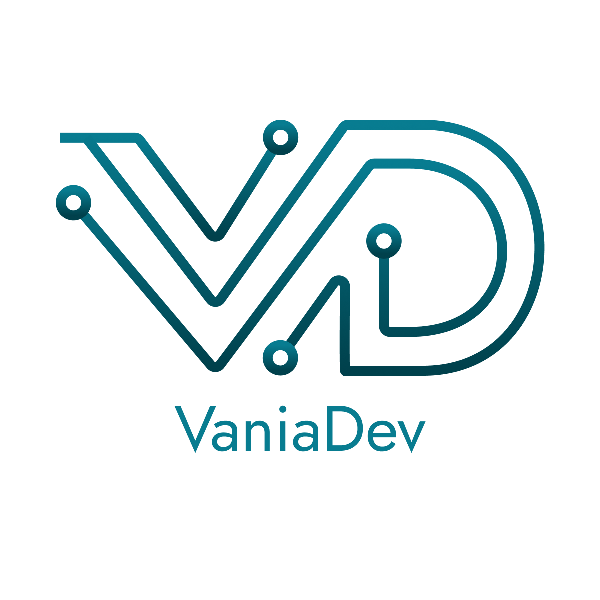
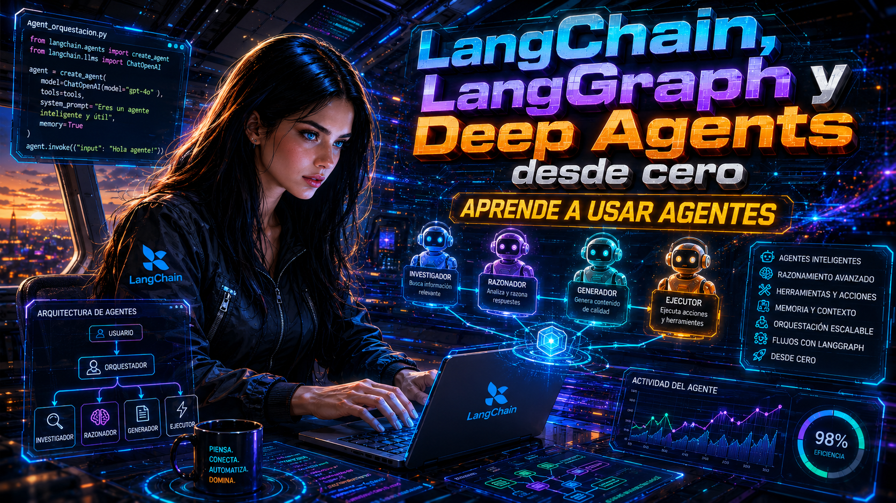

# LangChain, LangGraph and Deep Agents: Zero to Expert

[](https://github.com/Vania-Dev/langchain-and-langgraph-from-zero-2-expert/graphs/contributors)
[](https://github.com/Vania-Dev/langchain-and-langgraph-from-zero-2-expert/forks)
[](https://github.com/Vania-Dev/langchain-and-langgraph-from-zero-2-expert/stargazers)
[](https://github.com/Vania-Dev/langchain-and-langgraph-from-zero-2-expert/issues)

<br />
<div align="center">
  <a href="https://github.com/Vania-Dev">
    
  </a>

  <h3 align="center">LangChain, LangGraph and Deep Agents: Zero to Expert</h3>

  <a href="https://www.youtube.com/playlist?list=PLZLvS5NXZVysi0nnN6B3XpSw_6q-0ur5x">
    
  </a>

  <p align="center">
    <br />
    <a href="https://github.com/Vania-Dev/langchain-and-langgraph-from-zero-2-expert/issues/new?labels=bug">Reportar un Error</a>
    ·
    <a href="https://github.com/Vania-Dev/langchain-and-langgraph-from-zero-2-expert/issues/new?labels=enhancement">Solicitar Mejora</a>
  </p>
</div>

A comprehensive learning path for mastering LangChain, LangGraph & Deep Agents from beginner to advanced level.

## 🎯 Overview

This repository provides a structured approach to learning LangChain and LangGraph through practical examples and progressive complexity. Whether you're new to AI development or looking to enhance your skills, this guide will take you from zero to expert.

## 📚 Learning Path

### Chapter 1: Fundamentals (Beginner)
- Model invocation and basic interactions
- Message types and prompt templates
- Structured outputs with Pydantic
- Runnable interface and chain composition

### Chapter 2: RAG Foundations (Beginner-Intermediate)
- Document loading from multiple sources
- Text extraction and preprocessing
- Data indexing preparation
- File format handling (TXT, PDF, Web)

### Coming Soon: Advanced Topics
- Vector databases and embeddings
- Retrieval strategies and optimization
- LangGraph workflows and state management
- Production deployment and monitoring

## 🚀 Getting Started

### Prerequisites
- Python 3.8+
- Basic understanding of Python programming
- Familiarity with AI/ML concepts (helpful but not required)
- **Ollama installed locally** (required for running examples)
  - Download from: https://ollama.ai
  - Pull the model: `ollama pull llama3.2:3b`

### Installation
```bash
# Core LangChain dependencies
pip install langchain langchain-ollama langchain-community pydantic

# Document processing dependencies
pip install beautifulsoup4 pypdf

# Vector store and embeddings
pip install faiss-cpu sentence-transformers

# Advanced RAG techniques
pip install umap-learn scikit-learn numpy

# Optional: For advanced features
pip install langgraph
```

## 📁 Repository Structure

```
Examples/
├── Chapter 1 Fundamentals with LangChain/
│   ├── 01_Invocar_modelo.py         # Basic LLM invocation with Ollama
│   ├── 02_Human_message.py          # Working with human messages
│   ├── 03_system_message.py         # System message configuration
│   ├── 04_Prompt_template.py        # Creating prompt templates
│   ├── 05_Chat_prompt_template.py   # Chat-specific prompt templates
│   ├── 06_JSON_output.py            # Structured JSON responses with Pydantic
│   ├── 07_Runnable_interface.py     # LangChain runnable interface
│   └── 08_Imperative_composition.py # Composing chains imperatively
└── Chapter 2 RAG Part One Indexing Data/
    ├── files/
    │   ├── OCR.pdf                           # Sample PDF for testing
    │   └── test.txt                          # Sample text file for testing
    ├── 01_Convert_Documents_2_text.py        # Loading text documents
    ├── 02_Convert_Web_2_Text.py              # Web scraping with BeautifulSoup
    ├── 03_Convert_PDF_2_Text.py              # PDF processing with PyPDF
    ├── 04_Splitting_Text_into_chunks.py      # Text chunking strategies
    ├── 05_Generating_Text_Embeddings.py      # Creating vector embeddings
    ├── 06_Working_with_Vector_Store.py       # FAISS vector database
    ├── 07_Tracking_Changes_to_Your_Documents.py # Document versioning
    ├── 08_MultiVectorRetriever.py            # Advanced retrieval patterns
    ├── 09_ColBERT_Optimizing_Embeddings.py   # ColBERT optimization
    └── 10_RAPTOR.py                          # Recursive abstractive processing
```

## 🛠 Examples by Chapter

### Chapter 1: LangChain Fundamentals
Progressive examples covering core LangChain concepts:

- **Model Invocation**: Direct interaction with Ollama models
- **Message Types**: Human and system message handling
- **Prompt Engineering**: Template creation and customization
- **Structured Outputs**: JSON responses with Pydantic validation
- **Runnable Interface**: LangChain's composable architecture
- **Chain Composition**: Building complex workflows

### Chapter 2: RAG - Data Indexing
Document processing and preparation for retrieval:

- **Text Documents**: Loading and processing plain text files
- **Web Content**: Scraping and extracting web page content
- **PDF Processing**: Extracting text from PDF documents
- **Text Chunking**: Splitting documents into optimal chunks
- **Embeddings**: Generating vector representations of text
- **Vector Stores**: Working with FAISS for similarity search
- **Document Tracking**: Managing document changes and versions
- **Multi-Vector Retrieval**: Advanced retrieval strategies
- **ColBERT**: Optimizing embeddings for better retrieval
- **RAPTOR**: Recursive abstractive processing with tree-organized retrieval

### Use Cases Covered
- 🤖 **Chatbot Development**: Interactive AI conversations
- 📄 **Document Processing**: Multi-format content extraction
- 🔍 **Information Retrieval**: RAG system foundations
- 🏗️ **Structured AI**: Reliable JSON output generation
- 🔗 **Workflow Automation**: Chaining AI operations

## 📖 Usage

1. Clone the repository
2. Install dependencies
3. Start with basic examples and progress sequentially
4. Experiment with the code and modify examples
5. Build your own projects using learned concepts

## 🎓 Learning Objectives

By completing this course, you will:
- Master LangChain fundamentals and advanced features
- Build sophisticated AI applications with LangGraph
- Understand production deployment best practices
- Create custom agents and multi-agent systems

## 🤝 Contributing

Feel free to contribute examples, improvements, or documentation updates through pull requests.


## 📧 Contact

[](https://youtube.com/@VANIADEV)
[](https://www.instagram.com/vania_dev_/)
[](https://www.tiktok.com/@vania_dev_)
[](https://www.facebook.com/SMAEMX)
[](https://beacons.ai/vaniadev)
[](https://www.linkedin.com/in/ivan-castaneda-nazario/)
[](https://vaniadev.super.site/)
[](https://buymeacoffee.com/vania_vaniusha)

---

<div align="center">

**Hazlo con el tipo de ❤️ que deja huellas en el alma**

[⭐ Star this repo](https://github.com/Vania-Dev/langchain-and-langgraph-from-zero-2-expert) • [🐛 Reportar Bug](https://github.com/Vania-Dev/langchain-and-langgraph-from-zero-2-expert/issues) • [✨ Solicitar Feature](https://github.com/Vania-Dev/langchain-and-langgraph-from-zero-2-expert/issues)
